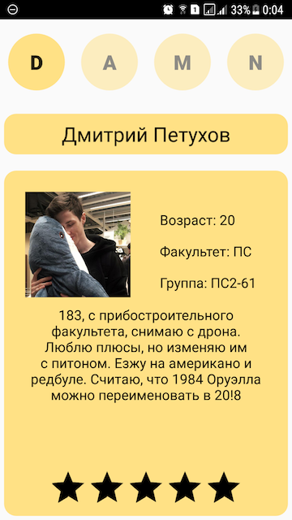
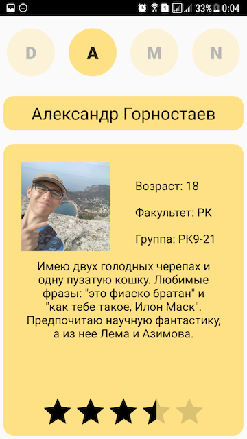
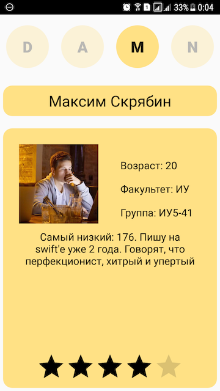
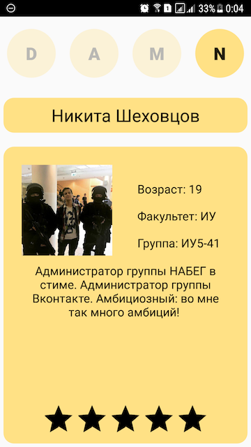

# BESTHACK HACKATHON 2018
## Приложение, представляющее команду DAMN HACK
### Участники
* Дмитрий Петухов, ПС2-61 :new_moon_with_face:
* Александр Горностаев, РК9-21 :dog:
* Максим Скрябин, ИУ5-41  – Капитан :zap:
* Никита Шеховцов, ИУ5-41 :alien:


## Начало работы
Приложение имеет версии для платформ iOS и Android
Далее приведены инструкции по установке приложения на устройство на базе каждой из представленных ОС
### iOS:
Для установки скачайте `.ipa` файл на свой компьютер, а затем установите его на свое устройство при помощи такого ПО, как [Cydia Impactor](http://www.cydiaimpactor.com).
### Android:
Для установки скачайте `.apk` файл на свое `android` устройство, а затем установите его

Готово! Теперь вы можете наслаждаться замечательной работой и прекрасным дизайном приложения команды ```DAMN HACK```

## О нашем приложении
Внимание! Скачивая и устанавливая наше приложение, вы рискуете столкнуться с лучшим продуктом, представляющим команду на хакатоне ```BEST HACK 2018``` 

Ниже приведены скриншоты, иллюстрирующие интерфейс нашего приложения

### Скриншоты на Android
 
 

### Скриншоты на iOS
<br>
 
<br>
 

Между участниками можно перемещаться, используя нажатия на элементы `D`, `A`, `M` и `N`

Можно выставлять участникам команды рейтинг, при его изменении данные загружаются в облако и при последующих запусках будет подгружен автоматически

## Использованные продукты и технологии
- [Parse](http://parseplatform.org/) - с помощью данной Open-Source платформы была реализована работа с базой данных: загрузка рейтинга участников с сервера и передача данных в облако как на iOS, так и на Android
- [Cosmos](https://github.com/evgenyneu/Cosmos) - библиотека, добавляющая функционал рейтинговой системы в iOS
- [NVActivityIndicatorView](https://github.com/ninjaprox/NVActivityIndicatorView) - библиотека, добавляющая анимацию загрузки/работы с сервером в iOS


## Тесты
- На `Android` приложение тестировалось на реальном устройстве с помощью `Android Studio`
- На `iOS` приложение тестировалось как в симуляторе, так и на реальных устройствах.

## Разработка

- iOS - [Максим Скрябин](http://vk.com/morimax)
- Android - [Никита Шеховцов](https://vk.com/nikita.shekhovtsov) и [Дмитрий Петухов](https://vk.com/petukhovd)
- Интерфейс и вспомогательные работы - [Александр Горностаев](https://vk.com/id106779437)


