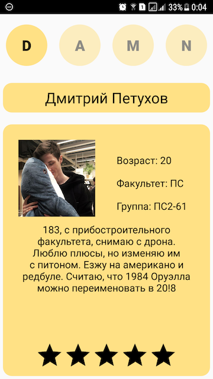
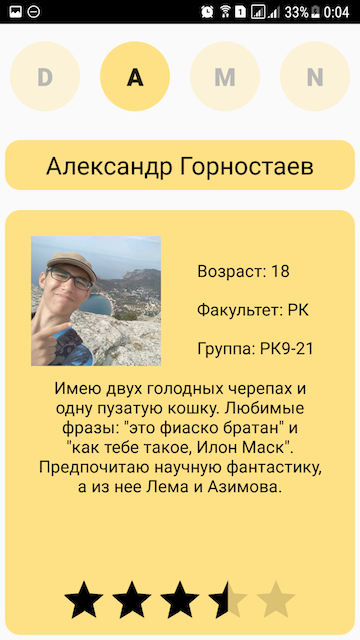
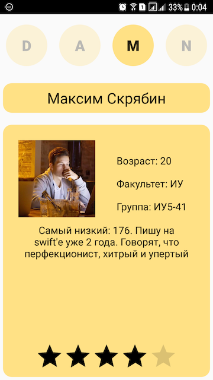
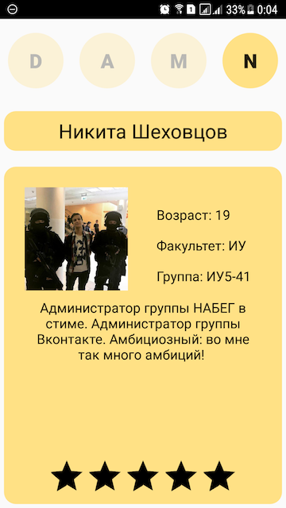

# BESTHACK HACKATHON 2018
## Приложение, представляющее команду DAMN HACK
### Участники
* Дмитрий Петухов, ПС2-61 :new_moon_with_face:
* Александр Горностаев, РК9-21 :dog:
* Максим Скрябин, ИУ5-41  –Капитан :zap:
* Никита Шеховцов, ИУ5-41 :alien:


## Начало работы
Приложение имеет версии для платформ iOS и Android
Далее приведены инструкции по установке приложения на устройство на базе каждой из представленных ОС
### iOS:
Тут должно быть описание установки на iOS устройство
### Android:
Для установки скачайте `.apk` файл на свое `android` устройство, а затем установите его

Готово! Теперь вы можете наслаждаться замечательной работой и прекрасным дизайном приложения команды ```DAMN HACK```

## О нашем приложении
Внимание! Скачивая и устанавливая наше приложение, вы рискуете столкнуться с лучшим продуктом, представляющим команду на хакатоне ```BEST HACK 2018``` 

Ниже приведены скриншоты, иллюстрирующие интерфейс нашего приложения

 

 

Между участниками можно перемещаться, используя нажатия на элементы ```D A M N``` выше

Можно выставлять участникам команды рейтинг, при его изменении данные загружаются в облако и при последующих запусках будет подгружен автоматически

## Использованные продукты и технологии
- [Parse](http://parseplatform.org/) - с помощью данной Open-Source платформы была реализована работа с базой данных: загрузка рейтинга участников с сервера и передача данных в облако


## Тесты
- На ```android``` приложение тестировалось на реальном устройстве с помощью ```android studio```
- На ```iOS``` приложение тестировалось {на чем тестировалось}

## Разработка

- IOS - [Максим Скрябин](http://vk.com/morimax)
- Android - [Никита Шеховцов](https://vk.com/nikita.shekhovtsov), [Дмитрий Петухов](https://vk.com/petukhovd)
- Интерфейс и вспомогательные работы - [Александр Горностаев](https://vk.com/id106779437)


